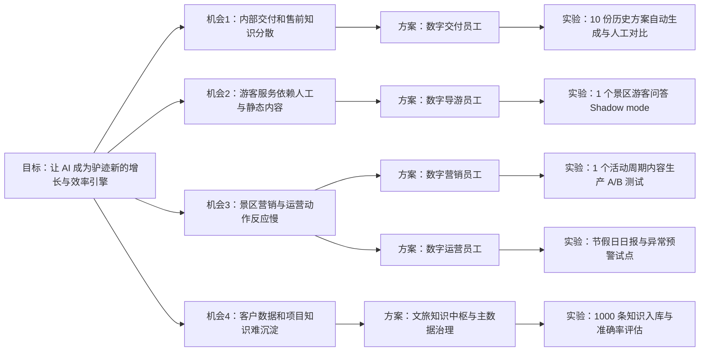

# 驴迹科技集团有限公司 AI 应用与数字企业战略汇报

日期：2026-03-07  
汇报对象：总监 / 高层管理团队  
汇报目标：围绕企业 AI 应用、数字企业和数字员工建设，给出一套可决策、可分阶段推进、可验证 ROI 的方案

---

## 一页结论

### 战略判断

驴迹不是从 0 开始做 AI。公司已经有旅游内容、景区场景、GIS/数据中心、客户案例和渠道生态。现在要解决的也不是“要不要做 AI”，而是怎么把分散在各条产品线和项目里的资产，整理成一套能复用、能追溯、能规模化变现的 AI 工作系统。

### 核心结论

1. 驴迹应被定义为“**早期 AI-shaped 公司**”，不是纯粹的 AI-first 自动化公司。
2. 建议路径不是另做一个泛化 AI 平台，而是建设“**1 个文旅 AI 中枢 + 4 类数字员工**”。
3. 未来 12 个月建议坚持“**内部提效先行，外部收入跟进；Copilot 先行，Autopilot 审慎推进**”。
4. `P0` 优先做知识底座和数字交付员工，`P1` 做数字导游与数字营销员工，`P2` 再做数字运营员工与多角色协同。

### 建议定义的产品

**产品名：驴迹文旅 AI 中枢（Lvji Tourism AI Hub）**  
**一句话定义：** 把驴迹的旅游内容、空间地图、运营数据和项目知识，整理成可直接调用的数字员工能力，先服务内部团队，再服务景区和文旅局客户。

### 预期业务结果

1. 用内部数字员工修复交付效率和毛利压力。
2. 用游客侧数字导游和数字营销员工做出可卖、可展示、可续约的 AI 产品能力。
3. 用景区运营员工把驴迹从“系统提供商”升级为“运营智能伙伴”。

---

## 方法说明

【步骤0】  
任务：确定本次汇报需要调用的产品管理 skills，并按顺序组织输出  
思考：这不是单一文案任务，而是“研究诊断 -> 战略定位 -> 场景叙事 -> 用户拆解 -> 投资评估”的完整链路，必须按技能链组织证据和结论。  
skills：`using-superpowers` -> `brainstorming` -> `company-research` -> `business-health-diagnostic` -> `ai-shaped-readiness-advisor` -> `problem-statement` -> `problem-framing-canvas` -> `positioning-statement` -> `positioning-workshop` -> `recommendation-canvas` -> `product-strategy-session` -> `press-release` -> `proto-persona` -> `customer-journey-map` -> `customer-journey-mapping-workshop` -> `discovery-process` -> `opportunity-solution-tree` -> `storyboard` -> `epic-hypothesis` -> `epic-breakdown-advisor` -> `user-story-splitting` -> `user-story` -> `user-story-mapping` -> `user-story-mapping-workshop` -> `prioritization-advisor` -> `tam-sam-som-calculator` -> `feature-investment-advisor`  
当前步骤简述结论：本报告按五个阶段输出，每个阶段都保留“任务、思考、skills、结论”，并把建议结论收敛到一个可执行路线图。

---

## 阶段1 调研诊断

【阶段1】  
任务：基于公开资料深度调查驴迹科技集团有限公司，提炼公司战略、产品方向、组织信号，诊断业务现状，并判断 AI-first / AI-shaped 方向  
思考：AI 战略不能凭空设计，必须从企业已有资产、财务压力、组织变化、公开产品动作和客户场景倒推  
skills：`company-research`、`business-health-diagnostic`、`ai-shaped-readiness-advisor`  
当前步骤简述结论：驴迹具备文旅行业做 AI-shaped 的基础资产，但还没有形成统一的 AI 工作系统；经营上处于恢复增长但效率承压阶段，因此第一优先级不是做大模型，而是做知识中枢、交付提效和可复制的 AI 模块。

### 1.1 Company Research：公司战略、产品方向与组织信号

| 模块 | 公开信息证据 | 战略含义 |
|---|---|---|
| 公司定位 | 官网“关于驴迹”写明：公司成立于 2013 年，2020 年于香港联交所上市，定位为智慧旅游产业解决方案专家；PDF 企业介绍同样强调“全球知名的智慧旅游产业解决方案专家” | 驴迹定位是“平台 + 解决方案 + 运营服务”的复合型文旅科技公司，不应把 AI 缩成单一聊天机器人项目 |
| 内容资产 | 官网披露截至 2024-06-30 已开发 66,229 个在线电子导览；PDF 披露拥有讲解、图文、软件版权及专利资产 | 文旅知识、内容版权和讲解素材是构建行业 AI 的第一护城河 |
| 产品结构 | PDF 显示产品中心包括在线电子导览、SaaS、一部手机游、目的地营销、景区共享玩乐设施；解决方案包括全域旅游、智慧景区、全域运营 | 驴迹已经覆盖游客服务、景区管理、营销运营和项目交付四类场景，适合构建多角色数字员工 |
| 技术底座 | PDF 与官网方案页均显示公司已有旅游云数据中心、3D GIS、数据交换平台、大数据中心、指挥调度中心、三大门户和四大应用系统 | 说明 AI 不是从零建设数据底座，而是在已有底座之上叠加智能层 |
| 渠道与生态 | 官网和 PDF 展示腾讯、高德、携程、同程、去哪儿、阿里云、百度等合作 | AI 能力可以经由现有渠道和客户网络快速商品化，而不必从 0 获取流量 |
| 公开 AI 动作 | 2024 年业绩公告写明推出融合 AI 大模型与 MR 技术的 `Lvji Travel Tool`；2025-09-25 中期报告写明推出 AI 导游助理数字人 `数景通`，并在暑期上线 `Lvji Travel Tool` | 公司管理层对 AI 对外产品化已有行动，下一步要从点状试点走向平台化和规模化 |
| 组织信号 | 招聘页写明“驴迹的组织逻辑不再是传统聘用，而是赋能”，并明确公司处于“经营转型与人才升级阶段” | 组织表述已经从“人力堆砌”转向“赋能型组织”，为数字员工叙事提供组织正当性 |
| 销售管理变化 | 2024-09-27 公告显示撤销销售总监岗位，由首席执行官直接负责销售管理 | 说明公司在强化经营集中度与销售效率，AI 项目必须能证明增收提效，而不是另一个概念投入 |
| 战略外延风险 | 2025-08-25 业务更新公告披露拟进入老挝矿业、农业自然教育等业务 | 这是明显的战略发散信号；越是多元化，越需要用 AI 强化原有文旅主业的效率和差异化，避免主线被稀释 |

### 1.2 我对驴迹现状的诊断

#### 战略层

1. 驴迹最强的不是底层模型能力，而是长期积累的文旅场景资产。
2. 公司已经跨过“没有数据、没有场景、没有产品入口”的早期门槛，但还没进入“统一智能操作系统”的阶段。
3. 驴迹的公开动作说明管理层接受 AI，但当前看更像产品点位尝试，而不是企业级工作方式重构。

#### 业务层

1. 驴迹同时做内容、软件、解决方案、运营，天然存在知识分散、交付分散、客户口径不一致的问题。
2. 经营恢复迹象已出现，但毛利与交付效率仍是主要压力。
3. 如果先做“炫技型 AI 功能”，容易增加 COGS 和售前复杂度；如果先做“内部提效 + 高复用外部模块”，则更有胜率。

#### 数据层

1. 公司拥有大量内容、地图、案例、运营数据，但尚无公开证据显示这些资产已经统一治理为 AI 可调用的上下文系统。
2. 官网披露的“787 个 5A 景区”与中国公开 5A 景区总量口径存在差异，应把公司披露数据视为“内容覆盖口径”，不是严格监管口径。
3. 这本身就是一个强信号：驴迹做 AI 前必须先做主数据和口径治理，否则数字员工会放大数据不一致问题。

### 1.3 Business Health Diagnostic：公司业务健康度诊断

> 注：`business-health-diagnostic` 偏 SaaS，但驴迹是“软件 + 项目 + 运营”的混合型文旅科技公司，因此以下诊断对框架做了适配，重点看增长、效率、资本健康、收入质量和战略聚焦。

#### 经营证据

1. 2024 年业绩公告显示：全年收入约人民币 3.852 亿元，年内亏损约人民币 1,575.3 万元。
2. 2024 年末现金及现金等价物约人民币 2.19 亿元，借款约人民币 1.75 亿元。
3. 2025 年上半年收入约人民币 1.866 亿元，同比增长 9.6%。
4. 2025 年上半年毛利率 35.0%，同比下降 2.5 个百分点。
5. 2025 年上半年销售开支同比下降 7.1%，行政开支同比下降 10.2%。

#### 健康评分

| 维度 | 评分(5分制) | 结论 | 证据与解释 |
|---|---:|---|---|
| 市场需求与增长 | 3.5 | 需求在，增长恢复中 | 2025H1 收入恢复增长，文旅市场 2024 年国内旅游人次与花费均明显回升 |
| 收入质量 | 2.5 | 混合模式，复用度仍需提升 | 收入来自导览、解决方案、运营等多类业务，公开资料缺少高质量经常性收入指标 |
| 效率与毛利 | 2.0 | 核心短板 | 毛利率下降，说明项目交付、服务成本或硬件/定制结构对利润有压力 |
| 资本健康 | 3.5 | 可控但不宽松 | 账上现金仍高于有息负债净额，但没有足够余量支撑长期低效试错 |
| 战略聚焦 | 2.5 | 存在发散风险 | 2025 年出现非主业扩张信号，要求文旅主航道更强的盈利解释力 |

#### 业务健康结论

驴迹当前不是“没有机会”，而是“**机会明确，但组织与利润结构要求更高的复用效率**”。  
因此，AI 项目必须满足三个前提：

1. 先证明效率，不做纯概念。
2. 先沉淀复用底座，不做一次性客制化。
3. 先绑定现有产品与客户，不另开一条昂贵的新业务线。

### 1.4 优先行动项

| 优先级 | 行动项 | 原因 |
|---|---|---|
| P0 | 建立统一文旅知识中枢与主数据口径 | 没有统一上下文，所有 AI 能力都会失真 |
| P0 | 先做数字交付员工，解决售前/交付/客服效率问题 | 最快改善交付人效和毛利，内部阻力最小 |
| P1 | 基于现有电子导览和数景通，升级数字导游员工 | 对外价值最直观，可形成收入模块 |
| P1 | 把目的地营销和全域运营能力产品化为数字营销员工 | 内容型 AI ROI 高，易复制、易演示 |
| P2 | 进入景区运营调度、预警、经营建议等数字运营员工 | 价值大，但对数据质量和组织配合要求高 |

### 1.5 AI-Shaped Readiness：AI-first 还是 AI-shaped

#### 判断结果

**结论：驴迹应被定义为“早期 AI-shaped 公司”，但当前执行成熟度仍偏 AI-first。**  

解释：

1. 如果只看 `数景通`、`Lvji Travel Tool` 这类公开动作，驴迹已经在做 AI-first 层面的产品增强。
2. 但从组织、数据、流程和治理看，驴迹更大的机会是用 AI 重构工作方式和产品交付方式，这属于 AI-shaped。
3. 目前最大缺口不在“模型能力”，而在“上下文设计、角色编排、流程闭环和组织采用”。

#### 五项能力评估

| 能力维度 | 评分(5分制) | 当前判断 | 证据 | 建议优先级 |
|---|---:|---|---|---|
| Context Design | 2.0 | 弱 | 内容、GIS、项目文档、运营数据分散在多产品线和多项目中，公开资料未见统一 AI 知识治理 | 最高 |
| Agent Orchestration | 1.5 | 很弱 | 已有点状 AI 产品，但尚未看到多角色、多系统、多审批流的企业级智能编排 | 最高 |
| Outcome Acceleration | 3.0 | 中等 | 电子导览、全域旅游、智慧景区已有现成入口，AI 可以较快嵌入现有流程 | 高 |
| Team-AI Facilitation | 2.5 | 中低 | 招聘页有赋能导向，但尚无公开证据说明团队日常已围绕 AI 重构协作方式 | 高 |
| Strategic Differentiation | 3.5 | 中高 | 文旅内容、GIS、客户案例和渠道生态具备行业差异化潜力 | 高 |

#### 能力建设顺序

1. **先建 Context Design**：统一景区知识、讲解词、项目 SOP、客户案例、运营指标和权限口径。
2. **再建 Agent Orchestration**：把“问答、生成、审批、派单、回写”串成工作流，而不是单次聊天。
3. **同步建 Outcome Measurement**：所有数字员工都必须有明确的成功指标和人工兜底机制。
4. **最后规模化 Team-AI Facilitation**：把 AI 嵌入售前、运营、客服、内容团队的日常工作 SOP。

---

## 阶段2 战略定位

【阶段2】  
任务：定义客户问题，完成问题界定、定位陈述、价值边界、风险评估与完整战略流程  
思考：没有清晰定位，AI 方案会被理解成“什么都做”；必须先定义主问题、主用户和主价值，再收敛到一套产品战略  
skills：`problem-statement`、`problem-framing-canvas`、`positioning-statement`、`positioning-workshop`、`recommendation-canvas`、`product-strategy-session`  
当前步骤简述结论：驴迹 AI 战略的核心不是再做一个更聪明的导游，而是把现有文旅资产整理成一套可复用、可协同、可交付的数字员工系统。

### 2.1 Problem Statement：客户问题定义

#### 核心客户问题

**景区/文旅局客户问题**

景区运营方和文旅局希望在有限预算和有限人力下，同时提升游客服务、营销转化、现场运营和管理效率，但他们面对的是分散的内容、碎片化系统、迟滞的数据反馈和高度依赖人工经验的运营方式，因此很难持续提供实时、个性化、可复盘的旅游服务。

**驴迹内部企业问题**

驴迹内部售前、交付、内容、客服和运营团队正在试图服务越来越复杂的文旅场景，但知识分散在历史项目、导览内容、方案文档、客户案例和个人经验中，导致交付复用率不高、响应速度慢、培训成本高、利润容易被项目型工作稀释。

#### 统一问题陈述

> 驴迹及其客户都在试图用有限的人力，服务更复杂、更多变、更多角色参与的文旅场景；但目前知识、数据、地图、流程和经验是割裂的，导致服务不够实时，运营动作不够智能，交付不够标准化，AI 试点也难以沉淀为长期能力。

### 2.2 Problem Framing Canvas：问题框定

#### Look Inward

| 项目 | 内容 |
|---|---|
| 现有优势 | 大规模导览内容、版权资产、GIS 与数据中心、平台生态合作、景区/文旅局案例、既有游客入口 |
| 现有约束 | 数据口径不一致、收入结构混合、项目化交付重、AI 底座尚未统一、组织采用机制未知 |
| 如果不做 | AI 仍将停留在单点产品增强，不能提升组织杠杆；利润压力和交付复杂度会继续放大 |
| 如果做错 | 做成通用助手或重投入自研模型，会投入大、复用低、难变现 |

#### Look Outward

| 项目 | 内容 |
|---|---|
| 客户在做什么 | 景区/文旅局寻求智慧化、低人力、高服务质量的运营方式；游客期望实时问答、路线推荐和多语言服务 |
| 替代方案 | 通用大模型、低价外包内容生产、单点数字人、传统 BI 报表、景区自建轻量系统 |
| 外部驱动 | 文旅恢复增长、游客服务体验升级、政府对数字文旅与智能化建设持续重视 |
| 外部风险 | 政务与文旅数据合规要求高；生成式 AI 的幻觉、敏感信息泄露和不可追责问题必须受控 |

#### Reframe

| 项目 | 内容 |
|---|---|
| 真正问题 | 如何把驴迹已有资产变成统一的行业化上下文和数字员工，而不是继续以项目和人力分散交付 |
| 关键设计原则 | 行业化优先；Copilot 优先；知识可追溯；人工审批兜底；能力可产品化 |
| 非目标 | 不做自研底模；不做完全无人化景区；不做泛办公助手优先项 |

### 2.3 Positioning Statement：标准化定位陈述

#### Geoffrey Moore 定位陈述

For **已采用或可采用驴迹导览、智慧景区、全域旅游方案的景区集团、文旅局及驴迹内部交付运营团队**  
who need **把分散的旅游内容、GIS、运营数据和项目经验转成实时可执行的服务与运营动作**  
the **驴迹文旅 AI 中枢**  
is a **面向文旅场景的行业化 AI 工作平台与数字员工系统**  
that **同时提升游客服务质量、景区运营效率和驴迹交付杠杆**  
Unlike **通用大模型助手、单点数字人或孤立报表工具**  
our product **基于驴迹的景区知识、内容版权、GIS 场景、运营 SOP 和生态渠道，提供可追溯、可协同、可嵌入业务流程的专属智能**。

#### 一句话版本

**驴迹文旅 AI 中枢，是把驴迹的内容、地图、数据和流程能力转成数字员工的行业化 AI 平台。**

### 2.4 Positioning Workshop：定位共创与待确认问题

> 基于公开资料，以下定位已经可以形成一版“汇报级”结论；但若要进入立项和预算环节，建议与总监做一次 45 分钟定位共创，优先确认以下问题。

#### 待确认问题

1. 第一阶段的主客户，优先是驴迹内部，还是优先选已有景区客户做外部收费试点？
2. AI 模块的商业模式，是单独收费、打包到现有方案、还是作为续约增购工具？
3. 第一批 lighthouse 客户，优先选 5A/大型景区，还是选有数据基础的中型景区？
4. 数字员工的组织 owner，归产品中心、解决方案中心、运营中心，还是单独成立 AI PMO？
5. AI 目标优先是修复毛利、做新增收入，还是做资本市场叙事？
6. 对政务/景区客户的数据边界，能接受到什么程度的云侧模型和第三方模型调用？

#### 当前最佳假设

1. 第一阶段内部优先，外部 lighthouse 并行。
2. 商业模式优先“增购模块 + 项目打包 + 续约升级”。
3. 先从数据相对标准、合作关系深的景区试点。
4. AI 需要跨产品、交付、运营的 PMO 机制，不适合只挂在单一产品组。

### 2.5 Recommendation Canvas：价值、边界、风险

#### Business Outcome

1. 改善售前与交付效率，支撑毛利修复。
2. 提升 AI 模块在既有客户中的增购率与续约率。
3. 建立“文旅 AI”差异化认知，提升招投标和对外沟通竞争力。

#### Product Outcome

1. 让内部团队用同一知识底座完成检索、生成、审批、交付回写。
2. 让景区客户获得可用、可控、可追溯的数字导游、数字营销和数字运营能力。
3. 让驴迹从“项目交付方”进化为“行业 AI 工作系统提供方”。

#### Solution Hypothesis

如果驴迹建设一套统一的文旅 AI 中枢，并基于该中枢先发布数字交付员工、数字导游员工、数字营销员工，再逐步扩展到数字运营员工，那么公司可以在 12 个月内同时提升内部人效和对外 AI 模块收入，并在 18 个月内形成可复制的文旅 AI 产品矩阵。

#### 能力边界

| 能做到的程度 | 边界说明 |
|---|---|
| 问答与检索 | 可以基于可信知识源回答景区、路线、票务、设施、SOP、项目案例等问题 |
| 文案与内容生成 | 可以生成讲解词、营销文案、方案初稿、培训材料、日报周报等 |
| 推荐与建议 | 可以给出路线、活动、营销、调度、工单分流等建议 |
| 预警与摘要 | 可以识别异常、自动摘要、自动分类、自动提炼重点 |
| 流程协同 | 可以触发审批、派单、回写、任务跟进等工作流 |
| 不能独立决策的场景 | 涉及票价、合同承诺、投诉定责、政府对外口径、安全事故处置、重大调度等，必须人工审批 |
| 不能承诺的能力 | 不能承诺“完全无人运营景区”；不能承诺“零幻觉”；不能承诺“上线即全自动赚钱” |

#### 关键风险与缓释

| 风险 | 具体表现 | 缓释策略 |
|---|---|---|
| 数据口径不一致 | 5A/4A、景点信息、运营指标来源不统一 | 建立主数据标准、来源标签、更新时间和审核流程 |
| 幻觉与错误回答 | 游客导览和运营建议出现错误 | 限制知识源、增加引用、设置敏感问题拦截和人工兜底 |
| 多租户与合规 | 景区、政府、内部项目知识混用 | 数据分域隔离、权限控制、日志审计、客户私域部署选项 |
| 项目化拖累产品化 | 每个客户都提定制，导致复用失败 | 明确标准版与定制版边界，优先沉淀模板化能力 |
| 组织不采用 | 团队把 AI 当演示品，不进入真实流程 | 用 KPI、SOP、工时节省和签约支持数据推动采用 |

### 2.6 Product Strategy Session：完整战略流程

#### 战略主张

**定位：** 行业化文旅 AI 工作平台  
**问题界定：** 知识、地图、数据和流程割裂，导致服务、运营和交付难以规模化  
**解决方案探索：** 1 个 AI 中枢 + 4 类数字员工  
**路线图：** 内部提效 -> 对外导览与营销 -> 运营智能 -> 生态协同

#### 战略设计原则

1. 行业化优先于通用化。
2. 可追溯优先于炫技。
3. Copilot 优先于 Autopilot。
4. 先复用率，再追功能广度。
5. 先绑定现有产品收入，再扩新业务想象力。

#### 解决方案架构

| 层级 | 定义 | 对应能力 |
|---|---|---|
| L1 文旅知识中枢 | 文旅内容、地图、运营数据、项目 SOP、案例与权限治理 | 检索、引用、标签、审批、版本、租户隔离 |
| L2 Agent 工作流层 | 把问答、生成、审批、派单、回写串成流程 | 工作流编排、消息通知、人工审核、日志审计 |
| L3 数字员工层 | 面向角色的可售卖能力 | 数字交付、数字导游、数字营销、数字运营 |
| L4 产品接入层 | 驴迹既有产品和客户入口 | 电子导览、SaaS、一部手机游、全域旅游、智慧景区、运营后台 |

#### 12 个月路线图

| 阶段 | 时间 | 目标 | 核心交付 |
|---|---|---|---|
| P0 | 0-3 个月 | 建底座、先提效 | 文旅知识中枢 v1、数字交付员工 v1、数据与权限治理规则 |
| P1 | 4-8 个月 | 做外部收入样板 | 数字导游员工 v1、数字营销员工 v1、5-10 个 lighthouse 客户试点 |
| P2 | 9-12 个月 | 做运营闭环 | 数字运营员工 v1、景区日报/预警/调度建议、客户分层商业化方案 |

---

## 阶段3 关键场景

【阶段3】  
任务：倒推用户价值与叙事，形成愿景、人物画像、完整旅程、discovery 闭环和机会树  
思考：高层汇报不仅要有逻辑，还要有“看得见的未来”；必须把战略翻译成可感知的场景和验证路径  
skills：`press-release`、`proto-persona`、`customer-journey-map`、`customer-journey-mapping-workshop`、`discovery-process`、`opportunity-solution-tree`  
当前步骤简述结论：驴迹 AI 的第一性价值不只是“回答问题”，而是让景区客户、游客和驴迹内部团队都拥有一个可协同、可执行的数字助手网络。

### 3.1 Press Release：倒推发布稿

**发布日期（假设）：2027-01-15**

**标题：**  
驴迹发布“文旅 AI 中枢”，面向景区与文旅局推出四类数字员工

**副标题：**  
新平台将驴迹多年积累的导览内容、GIS 能力、运营数据和项目知识整合为统一 AI 底座，帮助客户提升游客服务、营销效率和景区运营智能水平。

**正文：**  
驴迹科技今日宣布推出“驴迹文旅 AI 中枢”，这是公司围绕智慧景区、全域旅游和在线电子导览业务推出的新一代行业化 AI 平台。平台基于驴迹多年积累的景区内容资产、空间地图能力、客户案例与运营经验，首批上线数字交付员工、数字导游员工、数字营销员工和数字运营员工四类能力。  

对景区和文旅局客户而言，平台将帮助其以更少的人力，提供更实时的游客服务、更高效的内容营销和更及时的现场运营响应。对驴迹内部而言，平台将显著提升售前、交付、客服和运营团队的知识复用率和项目效率。  

首批试点客户已经在导览问答、方案生成、日报自动化和营销内容生产等场景中取得初步成效。驴迹预计将在未来一年继续扩大 AI 模块的产品化交付，推动文旅行业从信息化走向数字员工协同。

**客户引述（假设）：**  
“以前我们的运营团队每天花很多时间汇总数据、处理游客常见问题和反复改文案。现在数字导游和数字运营助手能够先完成 70% 的基础工作，让团队把精力放到真正重要的运营动作上。”  

**管理层引述（假设）：**  
“驴迹不会把 AI 只做成一个展示功能。我们的目标是把 AI 变成业务引擎，让内部团队更高效、让客户更可持续地经营景区。”  

### 3.2 Proto Persona：基于假设的人物画像

#### Persona A：景区运营总监

| 项目 | 内容 |
|---|---|
| 姓名 | 张琳，38 岁，5A 景区运营总监 |
| 目标 | 提升游客满意度、节假日运营效率、活动效果和领导可见成果 |
| 痛点 | 数据来自多个系统；日报靠人工；游客咨询和投诉高峰压垮客服；营销内容跟不上节奏 |
| 决策标准 | 可落地、见效快、风险低、能对领导解释 ROI |
| 对 AI 的期待 | 不求全自动，但要能节省团队时间、减少错漏、提供建议 |
| 对 AI 的担心 | 错答、出事故、领导问责、系统太复杂、依赖外部模型泄密 |

#### Persona B：驴迹交付经理

| 项目 | 内容 |
|---|---|
| 姓名 | 陈峰，34 岁，驴迹解决方案/交付经理 |
| 目标 | 更快完成方案、招投标材料、项目培训和客户答疑 |
| 痛点 | 历史项目资料难找；每个客户都要重新拼 PPT 和方案；新人难复制老员工经验 |
| 决策标准 | 是否能减少重复劳动，是否不影响交付质量 |
| 对 AI 的期待 | 能先给出结构化初稿和案例匹配，减少熬夜改文档 |
| 对 AI 的担心 | 生成内容不准、客户信息泄露、最后还要重做一遍 |

#### Persona C：游客服务型用户

| 项目 | 内容 |
|---|---|
| 姓名 | 王悦，29 岁，自由行游客 |
| 目标 | 用更少时间搞清路线、演出、排队、拍照点和周边吃喝 |
| 痛点 | 景区信息分散；路线不清晰；现场排队、走冤枉路；找人工不方便 |
| 决策标准 | 回答快、可信、能直接指路、能个性化推荐 |
| 对 AI 的期待 | 像一个懂景区的随身导游 |
| 对 AI 的担心 | 回答空泛、不知道现场变化、推荐不准 |

### 3.3 Customer Journey Map：完整用户旅程

> 主旅程以 `景区运营总监` 为主，串联驴迹内部交付和游客体验。

| 阶段 | 用户动作 | 触点 | 情绪/顾虑 | 驴迹机会 | KPI |
|---|---|---|---|---|---|
| 认知 | 发现现有景区服务和运营效率不足 | 展会、案例、销售拜访、行业会议 | “AI 会不会只是演示？” | 用行业案例和 ROI 讲内部提效 + 对外服务双价值 | 线索转化率 |
| 评估 | 对比通用大模型、数字人、传统厂商方案 | 销售演示、方案书、试用环境 | “要不要改很多系统？” | 用现有导览/SaaS/运营后台嵌入式演示降低风险感 | POC 转化率 |
| 采购/试点 | 确定 1-2 个场景试点 | 合同、项目启动会、知识接入清单 | “会不会拖项目、数据会不会出问题？” | 先上标准场景：导览问答、方案生成、日报自动化 | 上线周期 |
| 上线 | 内部团队培训、知识接入、角色分配 | 管理后台、培训会、客服群 | “团队会不会不用？” | 做角色化入口、审批流和工时对比 | 激活率、周活 |
| 日常使用 | AI 导游服务游客；AI 助手支持运营和交付 | 游客端、小程序、后台、日报通知 | “回答准不准？能不能真的节省时间？” | 监控准确率、人工接管率、日报时效、营销产出量 | 自助解决率、工时节省 |
| 复盘/续约 | 对比试点前后效果，决定续约与扩模块 | 月报、季度复盘、管理层汇报 | “值不值这个钱？” | 提供 ROI 仪表板和下一模块升级建议 | 续约率、增购率 |

### 3.4 Discovery Process：从问题假设到验证闭环

| 阶段 | 核心问题 | 方法 | 样本 | 产出 | 决策门槛 |
|---|---|---|---|---|---|
| Discovery 0：问题澄清 | 哪个角色痛点最急、最愿意为 AI 付费？ | 访谈 + 桌面研究 | 5 个景区客户、5 个驴迹内部一线成员 | 问题清单、痛点排序、场景优先级 | 至少 3 个角色重复提到同类高频痛点 |
| Discovery 1：概念验证 | 数字交付员工和数字导游，哪个更有短期价值？ | 方案概念测试、点击原型、手工 concierge | 3 个现有客户、2 个销售机会 | 价值反馈、购买意愿、担忧点 | 至少 2 个客户愿意试点 |
| Discovery 2：工作流验证 | AI 是否真能节省时间，而不是增加返工？ | 手工半自动服务、Shadow mode | 驴迹售前/交付/客服团队各 1 组 | 工时对比、错误类型、审批节点 | 工时下降 25% 以上且返工可控 |
| Discovery 3：POC 试点 | 能否在真实景区数据和真实游客场景中运行？ | 1-2 个 lighthouse 景区试点 | 高配合度景区客户 | 使用数据、准确率、自助解决率 | 游客自助解决率 > 60%，后台周活稳定 |
| Discovery 4：商业验证 | 客户愿不愿意为 AI 模块付费或增购？ | 价格访谈、合同谈判、续约方案 | 试点客户和潜在增购客户 | 定价方案、打包方案 | 至少形成 3 个可复制付费样板 |

### 3.5 Opportunity Solution Tree：目标、机会、方案、实验

---

## 阶段4 用户价值故事、Epic 与故事地图

【阶段4】  
任务：把战略转成高层可理解的用户价值故事，再拆成 Epic、用户故事、故事地图与优先级计划  
思考：没有故事，高层不容易形成共识；没有拆解，团队无法执行  
skills：`storyboard`、`epic-hypothesis`、`epic-breakdown-advisor`、`user-story-splitting`、`user-story`、`user-story-mapping`、`user-story-mapping-workshop`、`prioritization-advisor`  
当前步骤简述结论：驴迹的 AI 路线应围绕三个核心角色展开：景区运营总监、驴迹交付经理、游客。先讲清价值故事，再以垂直切片拆解成可交付的发布版本。

### 4.1 Storyboard：给总监讲清用户价值故事

#### 故事板 A：景区运营总监的价值故事

| 帧 | 场景 | 变化前 | AI 介入 | 变化后 |
|---|---|---|---|---|
| 1 | 节假日前一周 | 张琳在多个群和系统里催数据、催活动文案 | 数字营销员工先生成活动内容与人群包建议 | 准备时间从 3 天缩短到半天 |
| 2 | 节假日当天上午 | 游客咨询暴增，人工客服压力大 | 数字导游员工承接高频问答和路线推荐 | 客服只处理高风险和复杂问题 |
| 3 | 中午高峰 | 张琳不知道哪几个点位拥堵最严重 | 数字运营员工自动生成拥堵和投诉摘要 | 现场调度更及时 |
| 4 | 下午复盘 | 日报要等各部门手工汇总 | AI 自动汇总客流、投诉、演出、收入要点 | 当天就能形成经营摘要 |
| 5 | 周会汇报 | 难以说明 AI 是否真的有价值 | 系统展示自助解决率、工时节省、活动转化 | 领导能看见 ROI |
| 6 | 续约决策 | 过去只续原系统，不愿加预算 | 因为看见效率与体验收益，客户愿意增购模块 | 驴迹获得增购与续约机会 |

#### 故事板 B：驴迹交付经理的价值故事

| 帧 | 场景 | 变化前 | AI 介入 | 变化后 |
|---|---|---|---|---|
| 1 | 新线索进来 | 陈峰先到处找历史案例和模板 | 数字交付员工自动匹配类似项目和方案结构 | 启动速度更快 |
| 2 | 写方案 | 反复复制粘贴，内容口径不一 | AI 基于知识中枢生成首版方案和 PPT 大纲 | 方案一致性提升 |
| 3 | 客户追问 | 需要临时拉群问同事 | AI 检索历史项目 FAQ 和边界说明 | 回应更稳、更快 |
| 4 | 项目启动 | 培训材料、里程碑计划重复编写 | AI 自动生成标准交付包 | 新人也能更快上手 |
| 5 | 售后问题 | 工单摘要和升级判断靠经验 | AI 自动分类、摘要和推荐处理路径 | 客服效率提升 |
| 6 | 季度复盘 | 无法证明交付团队的复用效率提升 | AI 工时节省和复用数据可视化 | 管理层更容易支持投入 |

#### 故事板 C：游客的价值故事

| 帧 | 场景 | 变化前 | AI 介入 | 变化后 |
|---|---|---|---|---|
| 1 | 入园前 | 王悦看攻略碎片化，不知道怎么安排行程 | 数字导游员工给出半日路线和避堵建议 | 决策更轻松 |
| 2 | 入园时 | 不知道演出、厕所、餐饮和拍照点在哪里 | AI 问答 + 地图指引联动 | 导览更顺滑 |
| 3 | 游览中 | 讲解内容静态、单向 | AI 根据位置和兴趣边走边讲 | 体验更个性化 |
| 4 | 遇到问题 | 找不到人工、投诉路径不清晰 | AI 先分流并必要时转人工 | 服务响应更快 |
| 5 | 离园后 | 记不住景点内容，也不知道是否值得复访 | AI 自动生成游玩摘要和二次推荐 | 带动复购和分享 |
| 6 | 对景区印象 | 感觉只是“景点信息展示” | 感觉景区“更懂我、更有服务感” | 景区口碑提升 |

### 4.2 Epic Hypothesis：Epic 与成功指标

| Epic | If / Then 假设 | 目标用户 | 成功指标 |
|---|---|---|---|
| Epic 1：文旅知识中枢 | 如果我们把导览内容、GIS、项目案例、SOP 和运营指标统一为可治理的知识中枢，那么所有数字员工的回答准确率、复用率和可追溯性都会显著提升 | 驴迹内部团队、景区后台用户 | 首次回答引用率 > 80%，知识命中率 > 70%，内容更新 SLA < 48 小时 |
| Epic 2：数字交付员工 | 如果售前、交付、客服都能基于统一知识生成方案、培训材料和工单处理建议，那么交付工时和培训成本会下降，项目毛利会改善 | 驴迹售前/交付/客服团队 | 方案初稿时间下降 50%，交付文档复用率 > 60%，试点团队周活 > 70% |
| Epic 3：数字导游员工 | 如果游客在驴迹导览入口获得可问答、可指路、可推荐、可转人工的实时服务，那么游客自助解决率和导览使用率会提升 | 游客、景区客服 | 游客自助解决率 > 60%，导览使用时长提升 20%，人工接管率可控 |
| Epic 4：数字营销与数字运营员工 | 如果景区和运营团队可以用 AI 自动生成内容、日报、预警和调度建议，那么营销产能和运营响应速度会明显提升 | 景区运营团队、驴迹运营团队 | 内容生产周期缩短 50%，日报生成时间缩短 80%，异常发现提前量提升 |

### 4.3 Epic Breakdown Advisor：按 9 种模式拆分

> 拆分原则：只接受“垂直切片”，每一片都要能被真实用户感知，不接受“前端一个故事、后端一个故事”式水平切分。

| 拆分模式 | 在本项目中的应用 | 示例故事切片 |
|---|---|---|
| 1. Workflow Steps | 先做完整但简单的端到端流程，再补中间复杂环节 | 先做“知识检索 -> 生成方案初稿 -> 人工审批 -> 导出”，再增加多角色审批 |
| 2. Operations (CRUD) | 对知识库和工单类能力按操作拆分 | 先做“查看/检索知识”，后做“创建知识”，再做“更新/归档知识” |
| 3. Business Rule Variations | 按客户私域、公共知识、内部知识等不同规则拆分 | 先支持公共景区知识问答，再支持客户私域知识问答 |
| 4. Data Variations | 按文本、图文、GIS、工单、日报等不同数据类型拆分 | 先做文本类知识，再做 GIS 点位与路径，再做结构化运营指标 |
| 5. Data Entry Methods | 先做简单录入和上传，再做高级 UI | 先支持 Excel/文档上传，后续再做可视化知识编排界面 |
| 6. Major Effort | 先实现一个完整场景，再扩到更多场景 | 先实现“方案生成”，再扩展到“投标书、培训手册、验收文档” |
| 7. Simple/Complex | 先做最简单可用版本，再做复杂推荐 | 先做固定路线推荐，再做多目标个性化路线规划 |
| 8. Defer Performance | 先让系统可用，再优化速度和并发 | 先保证正确率和引用，再优化秒级响应 |
| 9. Break Out a Spike | 在不确定性最高的地方先做时间盒验证 | 对“GIS + 实时导览联动”和“多租户权限隔离”先做技术 Spike |

### 4.4 User Story：核心用户故事

#### 用户故事 1：数字交付员工

作为一名 **驴迹交付经理**，  
我希望 **上传客户需求后，系统能自动检索相似案例并生成方案初稿**，  
以便 **我能减少重复劳动、提高方案一致性并更快响应客户**。

**验收标准**

1. Given 我上传客户需求文档，When 系统完成解析，Then 系统返回至少 3 个相似案例及其来源。
2. Given 系统已匹配案例，When 我点击生成方案，Then 系统输出标准结构的方案初稿并标注引用来源。
3. Given 我发现内容不准确，When 我编辑并提交反馈，Then 系统记录反馈并回写知识改进任务。

#### 用户故事 2：数字导游员工

作为一名 **游客**，  
我希望 **在景区内通过驴迹入口直接提问并获得路线、讲解和服务指引**，  
以便 **我能少走弯路、更好理解景点并快速解决问题**。

**验收标准**

1. Given 我提出景区设施或路线问题，When 系统回答，Then 回答必须带有景区知识来源或地图依据。
2. Given 我选择“亲子/老人/摄影”等偏好，When 系统推荐路线，Then 推荐必须考虑距离、时间和重点点位。
3. Given 我的问题超出 AI 可处理边界，When 系统识别风险，Then 必须提示并转人工或官方渠道。

#### 用户故事 3：数字营销员工

作为一名 **景区内容运营**，  
我希望 **输入活动目标和景区特色后，系统能生成多平台内容素材与选题建议**，  
以便 **我能更快完成内容生产并适配不同渠道**。

**验收标准**

1. Given 我输入活动主题、时间和客群，When 系统生成内容，Then 至少输出公众号版、短视频脚本版和 OTA 介绍版。
2. Given 我选择节假日场景，When 系统推荐选题，Then 系统给出选题、标题、传播节奏和素材清单。
3. Given 我修改内容并确认采用，When 我提交，Then 系统保留版本记录和后续复用标签。

### 4.5 User Story Mapping：故事地图与版本切片

#### Backbone

1. 接入知识
2. 生成/问答
3. 审核与回写
4. 运营与分析
5. 商业化与扩展

#### 版本切片

| Backbone 活动 | Release 1（P0） | Release 2（P1） | Release 3（P2） |
|---|---|---|---|
| 接入知识 | 导览文本、历史方案、FAQ 入库 | GIS 点位、路线、营销素材入库 | 运营指标、工单、预警规则入库 |
| 生成/问答 | 方案初稿生成、内部检索问答 | 游客导览问答、路线推荐、内容生成 | 运营日报、预警和调度建议 |
| 审核与回写 | 人工审批、引用来源、反馈回写 | 客户私域知识隔离、权限控制 | 多角色协同和审计报表 |
| 运营与分析 | 工时节省与使用热度统计 | 导览使用、自助解决、内容产出统计 | 经营复盘与 ROI 看板 |
| 商业化与扩展 | 内部试用，不对外单独售卖 | 导游/营销模块增购试点 | 标准版/增强版/私有化方案 |

### 4.6 Prioritization Advisor：优先级框架与执行计划

#### 采用的优先级框架

本项目建议使用 **“RICE + 战略必要性 + 依赖约束”混合框架**。

原因：

1. 单纯看影响和开发量，会低估知识底座这类平台型工作。
2. 单纯看战略价值，又容易把所有事情都判成高优先级。
3. 对驴迹来说，必须同时考虑 `短期 ROI`、`长期复用`、`对现有业务的嵌入难度`。

#### 能力优先级

| 能力 | Reach | Impact | Confidence | Effort | 战略必要性 | 优先级 |
|---|---:|---:|---:|---:|---:|---|
| 文旅知识中枢 v1 | 5 | 5 | 4 | 4 | 5 | P0 |
| 数字交付员工 v1 | 4 | 5 | 4 | 3 | 5 | P0 |
| 引用、审批、日志治理 | 4 | 5 | 4 | 3 | 5 | P0 |
| 数字导游员工 v1 | 5 | 4 | 3 | 4 | 4 | P1 |
| 数字营销员工 v1 | 4 | 4 | 4 | 3 | 4 | P1 |
| 客户私域知识与多租户 | 3 | 5 | 3 | 4 | 5 | P1 |
| 数字运营员工 v1 | 3 | 5 | 2 | 5 | 4 | P2 |
| 高级调度与自动闭环 | 2 | 4 | 2 | 5 | 3 | P2 |

#### 按能力划分的执行计划

| 优先级 | 能力 | 时间 | 负责人建议 | 关键动作 | 交付物 |
|---|---|---|---|---|---|
| P0 | 文旅知识中枢 v1 | 月 1-2 | AI PM + 数据产品 + 架构 | 定义知识域、主数据、权限、引用、更新时间规则 | 知识中枢、数据字典、治理规范 |
| P0 | 数字交付员工 v1 | 月 2-3 | AI PM + 解决方案中心 | 打通方案生成、案例检索、FAQ、培训材料生成 | 交付助手、审核台、反馈回写 |
| P0 | 安全与治理 | 月 2-3 | 架构 + 法务/信息安全 | 建租户隔离、敏感词、日志审计、人工审批 | 治理规则、审计日志、风险清单 |
| P1 | 数字导游员工 v1 | 月 4-6 | C 端产品 + 地图/GIS + 运营 | 选 1-2 景区试点问答、路线推荐、服务分流 | 游客入口、地图联动、人工转接 |
| P1 | 数字营销员工 v1 | 月 4-6 | 运营产品 + 内容团队 | 打通活动文案、渠道改写、选题建议、版本管理 | 内容工作台、模板库、复用标签 |
| P1 | 商业化包装 | 月 5-7 | 产品商业化 + 销售 | 设计标准版/增强版/项目打包方案 | 定价策略、销售物料、案例包 |
| P2 | 数字运营员工 v1 | 月 7-10 | B 端产品 + 解决方案 + 数据团队 | 建日报、异常预警、运营建议、调度看板 | 运营助手、日报模板、预警台 |
| P2 | ROI 看板与续约策略 | 月 9-12 | AI PMO + 财务BP + 客成 | 统一统计自助率、工时节省、增购率、续约率 | ROI 仪表板、续约话术、复盘机制 |

---

## 阶段5 业务价值与投资判断

【阶段5】  
任务：验证市场规模与投资价值，并给出做 / 不做建议  
思考：高层不会为“看起来很先进”的项目买单，只会为“足够大、足够近、足够可控”的项目买单  
skills：`tam-sam-som-calculator`、`feature-investment-advisor`  
当前步骤简述结论：文旅 AI 对驴迹不是小修小补，而是一个足够大、足够接近现有业务、并且有机会改善收入质量和毛利结构的中期机会；建议做，但必须分阶段做，且以标准化产品能力为主，不走重度客制化陷阱。

### 5.1 TAM / SAM / SOM：市场规模验证

#### 市场定义

本次市场测算聚焦于：**中国文旅景区与目的地的 AI 赋能市场，尤其是围绕游客服务、内容营销、运营协同和项目交付智能化的 B2B/B2B2C 机会。**

#### 市场证据

1. 文化和旅游部 2025-01-22 发布数据：2024 年国内出游人次 56.15 亿，同比增长 14.8%；国内游客出游总花费 5.75 万亿元，同比增长 17.1%。
2. 驴迹官网披露：截至 2024-06-30，公司已开发 66,229 个在线电子导览，并称覆盖 787 个 5A 和 5,602 个 4A 景区内容。
3. 驴迹现有业务已覆盖导览、SaaS、一部手机游、智慧景区、全域旅游和运营服务，说明其不是从 0 进入市场，而是站在既有客户网络上增售 AI。

#### 测算口径说明

由于公开资料没有给出“中国文旅 AI 软件市场”的统一官方口径，以下采用 **“宏观需求 + 底层客户池 + 驴迹可触达客户”** 的三层算法，作为管理层决策用的保守估算。

#### TAM

**定义：** 中国文旅场景中可由 AI 软件与服务承接的广义市场机会。  

**保守估算方法：**

1. 以 2024 年国内旅游总花费 5.75 万亿元作为文旅总盘子。
2. 假设景区/目的地/文旅服务体系中可用于数字化和智能化软件服务的预算占比仅为 `0.05% - 0.10%`。

**计算：**

1. 5.75 万亿元 x 0.05% = 28.75 亿元
2. 5.75 万亿元 x 0.10% = 57.50 亿元

**TAM 结论：**  
**约 28.8 亿元 - 57.5 亿元 / 年**

> 说明：该口径用于判断市场不是“小机会”。它是保守预算占比法，不是行业统计口径。

#### SAM

**定义：** 驴迹凭现有产品形态、客户关系和文旅场景能力，3 年内可服务的核心市场。  

**保守估算方法：**

1. 以驴迹已覆盖的高等级景区内容池作为可服务核心客户池：`787 + 5,602 = 6,389` 个高等级景区相关资源口径。
2. 假设 AI 模块年均可实现 `15 万 - 50 万元 / 客户` 的标准化合同价值。

**计算：**

1. 6,389 x 15 万元 = 9.58 亿元
2. 6,389 x 50 万元 = 31.95 亿元

**SAM 结论：**  
**约 9.6 亿元 - 32.0 亿元 / 年**

> 说明：由于驴迹官网的景区口径与公开监管口径不完全一致，以上更适合作为“现有内容与客户可触达池”的商业估算，而非政府统计口径。

#### SOM

**定义：** 驴迹在未来 1-3 年内最现实可获取的市场份额。  

**保守估算方法：**

1. 1 年内形成 10-20 个付费 lighthouse 客户。
2. 3 年内累计获取 120-180 个 AI 模块客户。
3. 单客户年均 AI 合同价值保守按 `25 万 - 40 万元` 估算。

**计算：**

1. 120 x 25 万元 = 3,000 万元
2. 180 x 40 万元 = 7,200 万元

**SOM 结论：**  
**约 0.30 亿元 - 0.72 亿元 / 年**

#### 市场规模判断

1. 对一家已有文旅客户基础的上市公司而言，这个机会足够大，且离现有业务足够近。
2. SOM 不需要一开始就很大，只要能在 1-3 年内形成几千万级新增高毛利 AI 合同收入，就已经具备战略意义。
3. 这项工作的价值不只在新增收入，还在于改善交付效率、提升续约增购，并强化公司在文旅 AI 上的定位。

### 5.2 Feature Investment Advisor：功能投资评估

#### 评估对象

1. 文旅知识中枢
2. 数字交付员工
3. 数字导游员工
4. 数字营销员工
5. 数字运营员工

#### 投资评估

| 能力 | 收入连接 | 成本结构 | ROI 判断 | 战略价值 | 建议 |
|---|---|---|---|---|---|
| 文旅知识中枢 | 间接，支撑全部后续收入 | 一次性平台投入中等；后续运维可控 | 单独看 ROI 一般，但作为平台价值极高 | 是所有数字员工的基础，不做则后续失真 | 做，P0 |
| 数字交付员工 | 间接，主要改善毛利和签约效率 | 开发和模型调用成本较低 | 短期 ROI 最强 | 直接改善人效，内部 adoption 更容易 | 做，P0 |
| 数字导游员工 | 直接和间接兼有，可带来增购、续约和品牌价值 | GIS、游客端接入和模型调用成本中等 | 中高 | 对外价值最直观，是 AI 形象入口 | 做，P1 |
| 数字营销员工 | 可作为增购模块，也可提升运营服务产能 | 内容生成成本低，边际成本较优 | 高 | 最容易标准化与复制 | 做，P1 |
| 数字运营员工 | 直接收入潜力高，但依赖数据质量与组织协同 | 集成成本最高，交付复杂度最大 | 中等，需试点验证 | 如果做成，将提升客单价与竞争壁垒 | 做，但后置到 P2 |

#### 不建议优先投资的方向

| 方向 | 不建议原因 |
|---|---|
| 自研底层大模型 | 资金消耗大，不是驴迹的核心优势 |
| 完全无人化运营 | 风险和责任边界过高，不适合文旅/政务场景 |
| 泛办公助手 | 易做但壁垒弱，不能体现驴迹的行业资产优势 |
| 重度定制的一客一版 AI | 短期可能签单，长期会吞噬毛利并破坏平台化节奏 |

#### 为什么本年度优先做 AI 中枢知识底座和 4 个数字员工，而不是通用办公 AI 数字员工

**结论：** 本年度不是不能做财务/行政等通用办公数字员工，而是不应把它们放到公司 AI 主航道。对驴迹来说，真正稀缺的不是再做几个“人人都能做”的办公助手，而是把文旅内容、GIS、项目案例、运营数据和组织经验沉淀成统一智能底座，并把它们转成可复用、可售卖、可持续优化的行业化数字员工能力。

| 判断维度 | AI 中枢知识底座 + 4 个数字员工 | 通用办公 AI 数字员工（如财务/行政） | 本年度判断 |
|---|---|---|---|
| 与公司现有资产匹配度 | 直接复用驴迹已有的导览内容、GIS、景区案例、客户网络和运营 SOP | 更多依赖通用流程和通用办公规则，和驴迹独有资产关联弱 | 应优先投向资产匹配度更高的方向 |
| 对主业务的作用 | 同时改善内部交付效率、客户体验、续约增购和招投标竞争力 | 主要改善后台管理效率，对游客服务和客户收入帮助间接 | 应优先投向能直接作用主航道收入与毛利的方向 |
| 护城河沉淀 | 每接入一个景区、项目和运营场景，知识底座都会变强，形成行业上下文壁垒 | 容易被标准 SaaS 或通用 Agent 替代，长期差异化弱 | 应优先投向可沉淀长期壁垒的方向 |
| ROI 结构 | 既有内部提效收益，也有对外模块增购、续约和新签机会 | 以内部降本为主，更多体现在管理费用优化，外部变现弱 | 今年应优先双重 ROI 路径，而不是单一降本 |
| 对外叙事与销售价值 | 数字导游、数字营销、数字运营可被客户直接感知，适合演示、试点和商业化 | 财务/行政助手客户感知弱，难成为签单抓手 | 应优先做客户看得见、愿意买单的能力 |
| 对组织建设的意义 | 倒逼统一知识治理、权限治理和 Agent 编排，是 AI-shaped 转型的关键动作 | 容易演变成部门级局部优化，形成新的信息孤岛 | 今年应先完成统一底座建设，再扩内部通用助手 |

进一步看，优先级取舍背后有 5 个更根本的原因：

1. **驴迹当前的主矛盾不在后台办公，而在交付效率、知识复用和产品化能力。** 前文经营诊断已经说明，公司处于“增长恢复但毛利承压、项目交付复杂、知识分散”的状态，因此最该解决的是影响主业务效率和毛利的瓶颈，而不是先优化相对边缘的后台流程。
2. **AI 中枢是所有行业化能力的前置条件，不先做，后面所有数字员工都会失真。** 前文 AI-shaped readiness 判断也已经指出，驴迹当前最大的缺口是 `Context Design` 和 `Agent Orchestration`。这意味着先做统一知识底座，不是技术偏好，而是避免后续所有 AI 场景各自为政、口径冲突、无法追溯的必要条件。
3. **4 个数字员工覆盖的是驴迹最有胜算的四个角色面。** 数字交付员工先修内部人效和毛利；数字导游员工提供最直观的游客侧价值；数字营销员工最容易标准化复制；数字运营员工则承接更高客单价的深层运营价值。它们共同构成一条从内部效率到外部收入、从单点能力到系统能力的连续路线。
4. **通用办公 AI 更适合采购或集成，不适合作为本年度核心自研方向。** 财务、行政、人事等场景虽然有提效价值，但其流程高度通用、市场成熟度更高、替代品更多。若驴迹把有限的产品、数据和交付资源投入这些场景，实际上是在用最宝贵的资源去做最不具差异化的事。
5. **如果今年先做通用办公助手，组织很容易被带回“分部门小优化”而不是“统一智能系统”路径。** 财务想要报销助手，行政想要会议助手，人事想要招聘助手，看起来都合理，但会迅速把 AI 资源拆散，最后得到的是多个局部工具，而不是一个可复用、可治理、可商业化的平台能力。

因此，更务实的年度策略应是：**主投入放在“文旅 AI 中枢 + 4 个数字员工”，少量预算用于通用办公 AI 的工具化试点或外部采购。** 前者决定驴迹未来是否拥有行业化 AI 产品和新的经营杠杆，后者只是锦上添花，不能代替主航道建设。

#### 建议结论

**建议：做。**  
但必须满足以下前提：

1. 按 `P0 -> P1 -> P2` 节奏分阶段建设。
2. 以标准化产品能力为主，定制化为辅。
3. 每个阶段都必须绑定经营指标，不允许只做展示型 AI。

---

## 面向总监的建议结论

### 战略方向

驴迹要做的不是再加几个 AI 功能，而是搭一套“**文旅 AI 工作系统**”。  
先在内部跑通，再把这套能力卖给景区和文旅局客户。

### 未来 12 个月建议抓三件事

1. **先修底座和人效。**  
先把知识中枢、数字交付员工和治理体系做起来，先拿到交付效率和毛利改善。

2. **再做对外可见价值。**  
把数字导游员工和数字营销员工做成客户看得见、愿意试点、愿意付费的模块。

3. **最后做经营智能闭环。**  
等知识、权限和客户试点跑通后，再进入数字运营员工和更高阶协同。

### 需要总监拍板的 4 个关键决策

1. 是否同意将“文旅知识中枢”定为所有 AI 项目的统一底座。
2. 是否同意第一阶段先从内部数字员工拿 ROI，而不是先追求对外炫技。
3. 是否同意设立跨产品、交付、运营的 AI PMO 机制。
4. 是否同意用 2-3 个 lighthouse 客户验证商业化，而不是全面铺开。

### 补充思考内容

除上述 4 个关键决策外，以下 3 项更适合作为汇报中的补充思考内容展开，帮助管理层理解为什么这些问题必须尽早明确。

| 思考决策项 | 理由 | 后果 |
|---|---|---|
| 1. 标准化优先还是客户定制优先，以及谁有特批权 | 这是平台化能否成立的核心。销售天然会推动定制签单，产品天然会推动标准化沉淀，必须由更高层设定边界和例外审批机制 | 很快会滑向“一客一版 AI”，知识底座失去复用价值，毛利和交付节奏再次被拖垮 |
| 2. 模型、部署与数据边界策略 | 文旅局、景区和内部项目知识涉及多租户、客户私域和合规边界，必须先定哪些数据可上云、哪些场景需私有化、哪些模型可调用 | 后续每个客户都会重复争论部署方式和安全边界，售前周期变长，风险也更高 |
| 3. 知识治理责任制：谁拥有内容质量、更新 SLA 和口径仲裁权 | AI 中枢能不能长期可用，关键不在首版上线，而在谁持续维护景区知识、项目案例、FAQ 和运营指标。必须明确 owner、更新时间和仲裁机制 | 知识库会在上线后迅速过期，AI 回答越来越不准，前线团队会很快失去信任 |

---

## 附录：核心来源

### 公司与产品

1. 驴迹官网首页：[https://www.lvji.cn/cn/index](https://www.lvji.cn/cn/index)
2. 驴迹官网关于页：[https://www.lvji.cn/cn/about](https://www.lvji.cn/cn/about)
3. 驴迹官网招聘页：[https://www.lvji.cn/cn/aboutUs/joinLvji](https://www.lvji.cn/cn/aboutUs/joinLvji)
4. 驴迹案例中心：[https://www.lvji.cn/cn/caseCenter/center](https://www.lvji.cn/cn/caseCenter/center)
5. 用户提供企业介绍 PDF：`/Users/wenjiayan/Library/Containers/com.tencent.xinWeChat/Data/Documents/xwechat_files/wxid_86b3u4zv5rsu21_945b/temp/drag/驴迹科技集团有限公司企业介绍_中文通用版20230407.pdf`

### 港股公告与财务

> 注：HKEX 披露易部分直链可能因站点策略发生变化。若直链失效，请在 [HKEX 披露易](https://www.hkexnews.hk/index_c.htm) 以“驴迹科技”加下列标题/日期检索。

1. 驴迹科技 2024 年业绩公告，日期 2025-03-28
2. 驴迹科技 2024 年年报，日期 2025-04-16
3. 驴迹科技 2025 年中期报告，日期 2025-09-25
4. 驴迹科技公告：撤销销售总监岗位，日期 2024-09-27
5. 驴迹科技业务更新公告，日期 2025-08-25

### 行业与市场

> 注：中国政府网部分政策页偶发反爬限制。若直链失效，可在中国政府网政策库按标题检索。

1. 文化和旅游部：2024 年度国内旅游数据情况（2025-01-22）：[https://zwgk.mct.gov.cn/zfxxgkml/tjxx/202501/t20250121_958012.html](https://zwgk.mct.gov.cn/zfxxgkml/tjxx/202501/t20250121_958012.html)
2. 中国政府网政策库：[https://www.gov.cn/zhengce/zhengceku/](https://www.gov.cn/zhengce/zhengceku/)
3. 公告标题：关于确定 19 家旅游景区为国家 5A 级旅游景区的公告，日期 2024-12-27
